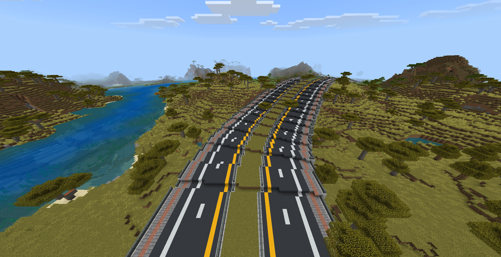

# 🏗️ Geometric Road Curves Add-on
> **Advanced Civil Engineering Tool for Minecraft: Bedrock Edition**

> **🎉 Happy New Year 2026!**
> Let's kickstart the year with precise engineering. Build smarter, smoother, and better roads in your Minecraft world this 2026!

**Geometric Road Curves** transforms Minecraft road building from simple block placement into precise Civil Engineering design. Powered by the Script API, this add-on calculates complex geometry to help you create realistic, smooth, and mathematically accurate road alignments directly on your smartphone.

---

## 📖 Documentation

This page provides a summary. For deep dives into every mode, vector logic, and advanced techniques, please read the full manual:

### [👉 Click here to read the Full Manual](https://khunaut369.github.io/Geometric-Road-Curves-Addon/)

---

## ✨ Key Features

### 🛣️ 1. Advanced Curve Algorithms
Go beyond simple circles. We support engineering-grade curves:
- **Simple Curve:** Constant radius circular arc.
- **Spiral Curve (Clothoid):** Transition curves that gradually change radius for realistic driving dynamics.
- **Compound & Taper:** Complex curves for intersections.

### 📐 2. Smart Vertical Alignment
Say goodbye to blocky stairs. The system automatically handles slopes:
- **Parabolic/S-Curve:** Smooth transitions between different elevations.
- **Apex Control:** Precisely define the peak of a bridge or the bottom of a tunnel (Mode A2/B2).

### 🏗️ 3. Template & Construction System
- **Template Cloning:** Build a 1-block wide slice of your road, and the system extrudes it along the curve.
- **Strict Mode Placement:** Prevents gaps and z-fighting (overlapping blocks) on curves using a voting algorithm.
- **Rotation Support:** Blocks rotate naturally with the curve alignment.

---

## ⚙️ Installation

⚠️ **IMPORTANT:** This add-on relies on the latest Script API features. You must enable the following in your world settings:

1. Go to **Settings** > **Game**.
2. Scroll down to **Experiments**.
3. Enable:
   - [x] **Beta APIs**

---

## 🚀 Quick Start Guide

Follow these steps to build your first Spiral Curve road:

### Step 1: Preparation
- Run command: `/tag @s add road`
- Hold a **Stone Pickaxe** (This is your Wand).

### Step 2: Select Mode
- Run command: `!mode a` (Mode A: Point-to-Point).

### Step 3: Define Start Vector (t1)
The system needs to know the starting direction and slope.
1. **Long Press** at the starting block (Origin).
2. **Long Press** at another block in the direction you want the road to start.
   - *System Message:* "t1 saved".

### Step 4: Define Points & Generate Curves
You build the road segment by segment.
1. **Long Press** to place **Point P1** (The start of the curve).
2. **Long Press** to place **Point P2** (The end of the first curve segment).
3. Run command: `!c spi`
   - *Result:* A spiral curve preview appears between P1 and P2.
4. **Long Press** to place **Point P3**.
5. Run command: `!c spi` again.
   - *Result:* A new curve segment generates from P2 to P3, continuing smoothly from the previous tangent.
6. Repeat for subsequent points.

### Step 5: Construction
1. Build a small slice of your road design (the template) nearby.
2. Stand facing the **direction of the road** (Forward).
3. Run command: `!sct` and select the template region (Bottom-Left to Top-Right).
4. Run command: `!set c` to place the blocks (this mode ignores air blocks).

---

## 🎮 Commands Summary

| Category | Command | Description |
| :--- | :--- | :--- |
| **Modes** | `!mode [a/a1/a2]` | Point-to-Point modes. |
| | `!mode [b/b1/b2]` | Intersection/Tangent-Target modes. |
| | `!mode c` | Roundabout mode. |
| **Geometry** | `!c sim` | Generate Simple Circular Curve. |
| | `!c spi` | **(Recommended)** Generate Spiral Clothoid Curve. |
| **Build** | `!sct` | Select Source Template (Face forward!). |
| | `!set [a/b/c]` | Place blocks (a=Overwrite, b=Fill, c=No Air). |
| **Tools** | `!und` | Undo last action. |
| | `!mov` | Move selected points. |
| | `!rst` | Reset all lines/data. |

---

## 🤝 Credits & Inspiration

This project was built upon the research and foundational concepts provided by the following developers:

- **kous500**: For the **CurveBuilding** project, which pioneered the concepts of structure tools and curve generation logic on Bedrock Edition.
- **sisilicon**: For **WorldEdit-BE**, which provided essential libraries for geometry, math, and data handling structures.
- **Developer**: khunaut369

---

## 📄 License

This project is licensed under the **GNU General Public License v3.0**.
See the [LICENSE](LICENSE.txt) file for details.
